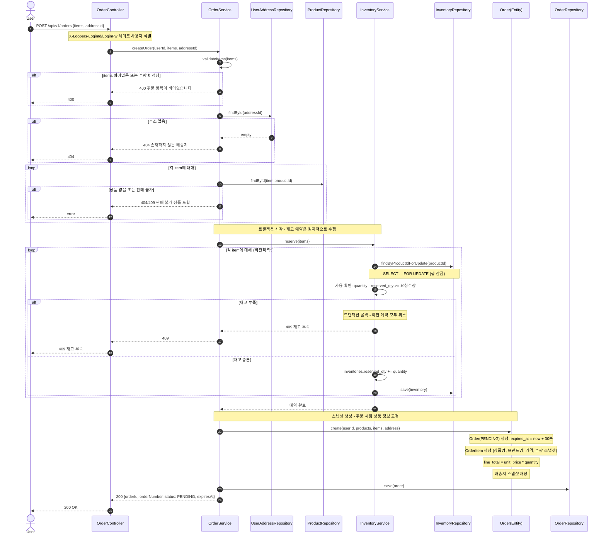
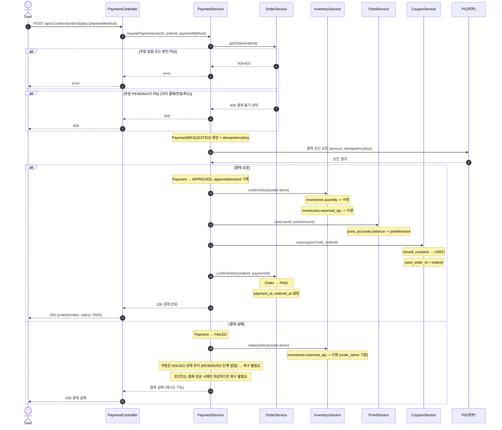
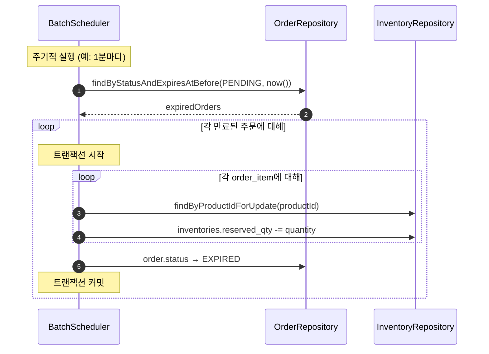
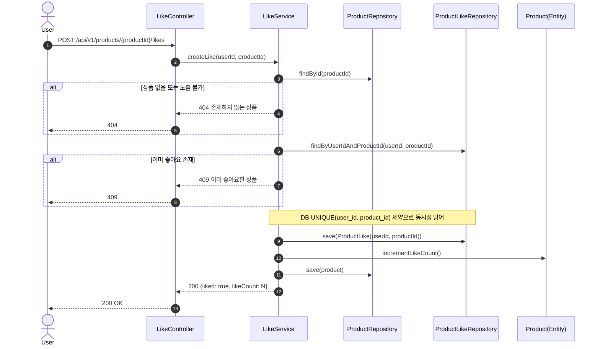
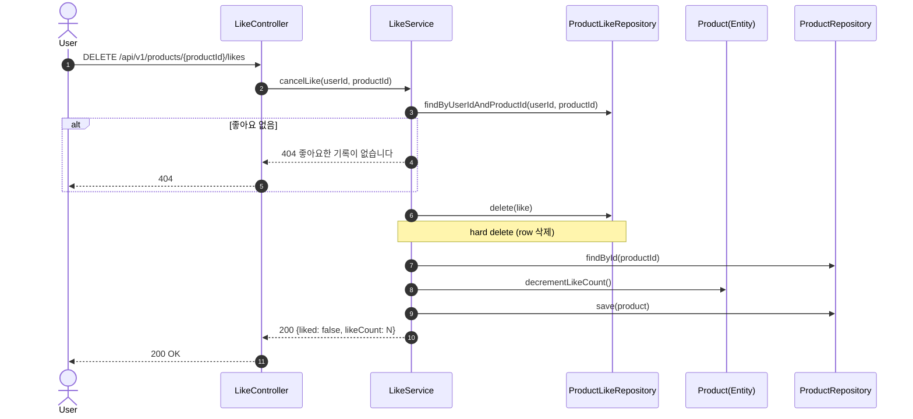
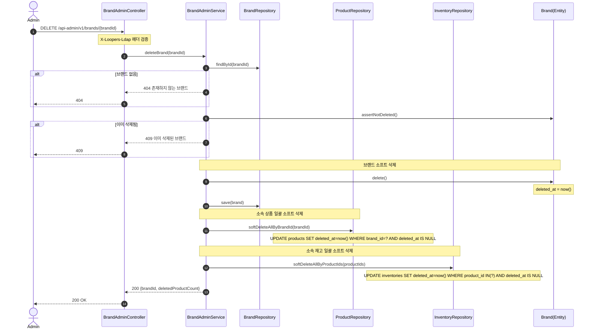
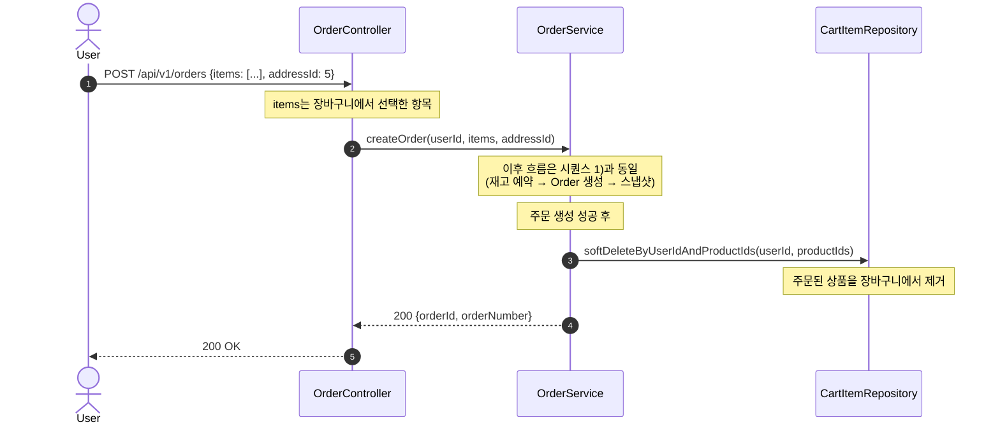
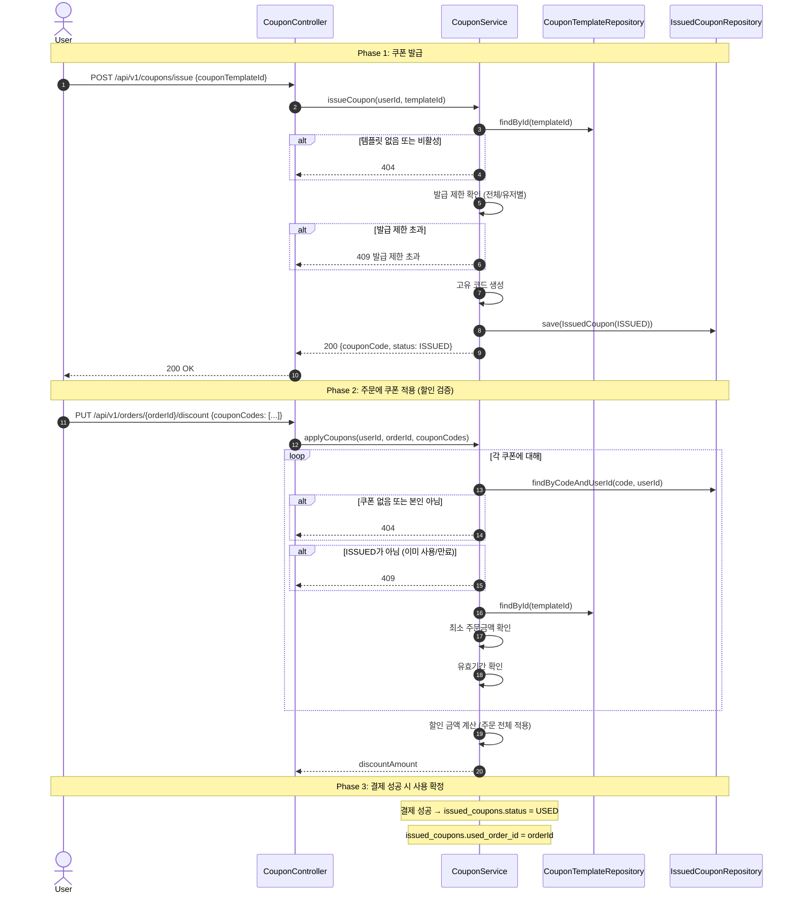
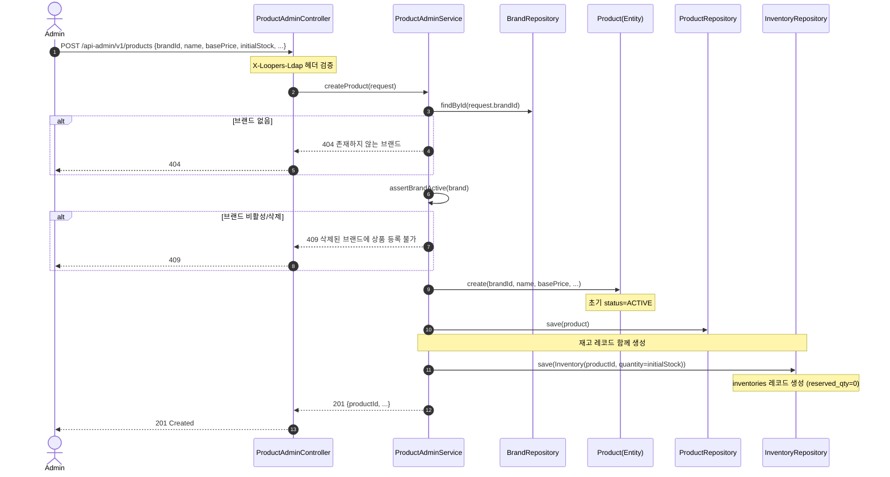

# 02. 시퀀스 다이어그램

---

## 작성 원칙

- 기능 하나당 하나의 시퀀스
- 최소 레이어: User → Controller → Service/Facade → Domain(Entity/Policy) → Repository
- 존재 여부 체크, 분기(alt/else), 상태 변경을 표현
- 도메인 객체가 "빈 껍데기"가 되지 않도록, 검증/상태 전이 책임을 도메인에 부여
- 01-requirements.md에 정의된 API URI 기준으로 작성

## 시퀀스 선별 기준

단순 CRUD는 생략하고, **상태 전이/동시성 제어/연쇄 처리/다중 도메인 조율** 등 설계 의도가 드러나는 핵심 흐름만 선별.

| # | 시퀀스 | 선별 이유 |
|---|--------|----------|
| 1 | 주문 생성 (재고 예약) | 핵심 흐름: reserved_qty 예약 + 스냅샷 + 만료 설정 |
| 2 | 결제 요청 (성공/실패) | 핵심 흐름: 다중 도메인 조율 (가장 복잡한 트랜잭션) |
| 3 | 주문 만료 배치 | 배치 처리: 만료된 PENDING 주문 자동 정리 |
| 4 | 상품 좋아요 등록/취소 | hard delete + like_count 동기 증감 |
| 5 | 브랜드 삭제 (연쇄) | Aggregate 간 연쇄 soft delete |
| 6 | 장바구니 → 주문 전환 | 장바구니 기반 주문 생성 흐름 |
| 7 | 쿠폰 발급 → 적용 | 쿠폰 라이프사이클 |
| 8 | 어드민 상품 등록 | 브랜드 검증 + 재고 초기화 |

---

## 1) 주문 생성 (재고 예약 + 스냅샷)

핵심: 복수 상품 → reserved_qty 증가(비관적 락) → Order(PENDING) + OrderItem(스냅샷) → 30분 만료 설정

**책임 분리 포인트**:
- `OrderService`: 흐름 조율 (애플리케이션 서비스)
- `InventoryService`: 재고 예약 검증/수행 (도메인 서비스)
- `Order(Entity)`: 주문 생성 + OrderItem 스냅샷 조립 (도메인)
- `InventoryRepository`: 비관적 락 + 영속화 (인프라)

**트랜잭션 경계**: `createOrder` 전체가 하나의 `@Transactional`

---

## 2) 결제 요청 (성공/실패 분기)

핵심: Payment 생성 → PG 승인 → 성공 시 다중 도메인 확정 / 실패 시 reserved_qty 복구

**설계 의도**:
- 결제 성공 시 다중 도메인이 하나의 트랜잭션에서 확정
- 포인트는 결제 성공 후에만 차감 → 실패 시 포인트 복구 불필요
- 쿠폰은 결제 성공 시 바로 USED 처리 (RESERVED 단계 없음 → 실패 시 복구 불필요)

---

## 3) 주문 만료 배치 처리

핵심: 30분 경과 후 미결제 PENDING 주문 자동 정리 + reserved_qty 복구

**배치 설계 포인트**:
- `commerce-batch` 모듈에서 Spring Batch 또는 `@Scheduled`로 구현
- 각 만료 주문 처리는 개별 트랜잭션 (하나 실패해도 나머지 영향 없음)
- 만료 시각 기준으로 인덱스 활용: `idx_orders_status_expires_at`
- 쿠폰은 ISSUED 상태 유지 (RESERVED 단계 없음) → 별도 복구 불필요

---

## 4) 상품 좋아요 등록 / 취소

### 등록

### 취소 (hard delete)

**hard delete 설계 근거**:
- 이력 추적 불필요
- `(user_id, product_id)` UK와 soft delete 조합 시 복잡도 증가 회피
- like_count 증감은 동일 트랜잭션 내에서 보장

---

## 5) 브랜드 삭제 (연쇄 상품 + 재고 삭제)

**설계 의도**:
- 브랜드 + 상품 + 재고 삭제는 하나의 트랜잭션 (정합성 보장)
- 기존 주문의 OrderItem 스냅샷에는 영향 없음

---

## 6) 장바구니 → 주문 전환

**설계 포인트**:
- 장바구니 → 주문은 별도 API가 아닌, 주문 생성 API의 입력으로 처리
- 주문 생성 성공 후 해당 항목을 장바구니에서 제거 (soft delete)
- cart_items.user_id로 직접 조회 (carts 테이블 없음)

---

## 7) 쿠폰 발급 → 적용 → 사용 확정

**쿠폰 상태 전이 요약**:
- `ISSUED` → 결제 성공 → `USED` (사용 확정)
- `ISSUED` → 유효기간 만료 → `EXPIRED`
- RESERVED 단계 없음 → 결제 실패 시 쿠폰 복구 불필요

---

## 8) 어드민 상품 등록 (브랜드 검증 + 재고 초기화)

**설계 의도**:
- 상품 등록 시 inventories 레코드도 함께 생성 (1:1 관계 보장)
- 브랜드가 ACTIVE일 때만 상품 등록 가능