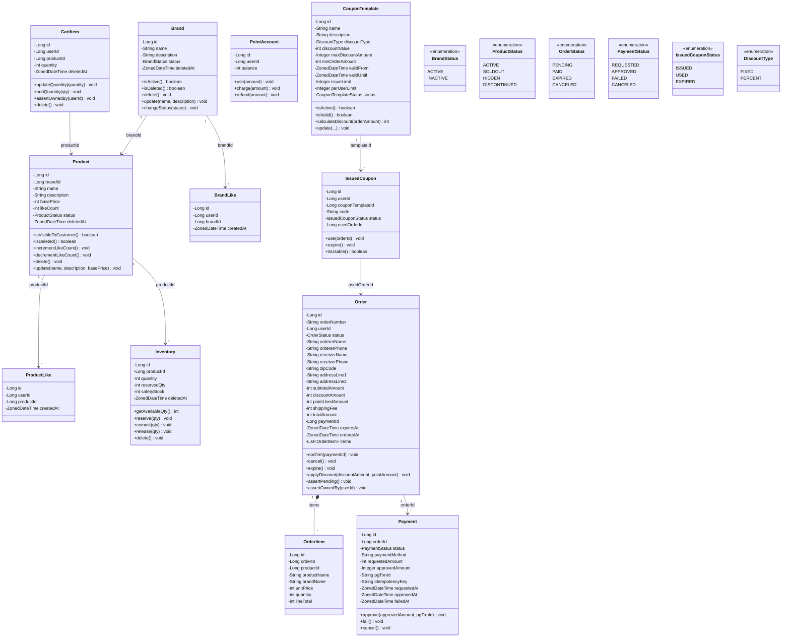

# 03. 도메인 객체 설계 (클래스 다이어그램)

---

## 설계 원칙

- **Entity**: 식별자(ID)를 가지며 생명주기가 있는 객체. 상태 변경 가능
- **VO (Value Object)**: 값 자체가 의미. 불변. 동등성 비교
- **Aggregate Root**: 외부에서 접근하는 유일한 진입점. 내부 일관성 보장
- 연관 관계: **단방향 기본**, 양방향 최소화
- 비즈니스 규칙은 도메인 객체에 위치 (Service에 로직 집중 방지)
- Lombok 사용 금지, 생성자/getter 직접 작성 (CLAUDE.md 규칙)

---

## 1. 전체 도메인 클래스 다이어그램



---

## 2. Aggregate 경계

| Aggregate Root | 포함 Entity/VO | 설명 |
|---------------|---------------|------|
| **Brand** | Brand | 브랜드 정보 관리. 삭제 시 소속 Product 연쇄 삭제 (Service 레벨 조율) |
| **Product** | Product | 상품 정보 + 좋아요 수 관리. 재고는 Inventory로 분리 |
| **ProductLike** | ProductLike | 좋아요 단독 Aggregate (Product와 ID 참조만) |
| **BrandLike** | BrandLike | 브랜드 좋아요 단독 Aggregate |
| **CartItem** | CartItem | 장바구니 항목 단독 Aggregate. user_id로 직접 참조 |
| **Inventory** | Inventory | 재고 수량 관리. 예약/확정/해제는 도메인 메서드 |
| **Order** | Order, OrderItem | 주문 + 항목(스냅샷). OrderItem은 Order와 동일 생명주기 |
| **Payment** | Payment | 결제 단독 Aggregate. Order와 ID 참조 |
| **PointAccount** | PointAccount | 포인트 잔액 관리. 독립 도메인 |
| **CouponTemplate** | CouponTemplate | 쿠폰 정책 마스터. 쿠폰은 주문 전체에 적용 |
| **IssuedCoupon** | IssuedCoupon | 발급된 쿠폰 단독 Aggregate. 상태 전이 관리 (ISSUED/USED/EXPIRED) |

### Aggregate 경계 설계 근거

- **ProductLike를 Product에 포함하지 않은 이유**: Like의 생명주기는 Product와 독립적. Product 변경 없이 Like만 생성/삭제됨. 포함 시 잠금 범위 불필요하게 확대
- **OrderItem을 Order에 포함한 이유**: OrderItem은 Order 없이 존재할 수 없고, 주문 생성 시 함께 생성. 외부에서 직접 조작하는 유스케이스 없음
- **Inventory를 Product에 포함하지 않은 이유**: 재고 예약/확정/해제의 생명주기가 Product의 수정과 독립적. 비관적 락의 범위를 재고만으로 한정
- **Payment를 Order에 포함하지 않은 이유**: 하나의 주문에 여러 결제 시도 가능 (재시도). 결제 상태 관리가 독립적
- **CartItem을 단독 Aggregate로 설정한 이유**: carts 테이블 제거로 user_id 직접 참조. 장바구니 전체에 대한 비즈니스 규칙 없음

---

## 3. 핵심 도메인 규칙의 위치

| 규칙 | 위치 | 설명 |
|------|------|------|
| 재고 가용 수량 계산 | `Inventory.getAvailableQty()` | quantity - reservedQty |
| 재고 예약 | `Inventory.reserve(qty)` | reservedQty += qty, available 확인 |
| 재고 확정 차감 | `Inventory.commit(qty)` | quantity -= qty, reservedQty -= qty |
| 재고 예약 해제 | `Inventory.release(qty)` | reservedQty -= qty |
| 좋아요 수 증감 | `Product.incrementLikeCount()` / `decrementLikeCount()` | likeCount < 0 방지 |
| 고객 노출 여부 | `Product.isVisibleToCustomer()` | status IN (ACTIVE, SOLDOUT) |
| 주문 생성 + 스냅샷 | `Order(생성자)` + `OrderItem(생성자)` | 주문 시점 정보 고정 |
| 주문 금액 계산 | `Order.calculateTotalAmount()` | subtotal - discount - point + shipping |
| 할인 적용 | `Order.applyDiscount()` | PENDING 상태에서만 |
| 주문 확정 | `Order.confirm(paymentId)` | PENDING→PAID, orderedAt 설정 |
| 쿠폰 할인 계산 | `CouponTemplate.calculateDiscount()` | FIXED: 고정액, PERCENT: 비율(max 제한) |
| 쿠폰 사용 확정 | `IssuedCoupon.use(orderId)` | ISSUED→USED, usedOrderId 설정 |
| 포인트 차감 | `PointAccount.use(amount)` | balance 충분 여부 검증 + 차감 |
| 결제 승인 | `Payment.approve()` | REQUESTED→APPROVED |
| 브랜드 삭제 시 상품 연쇄 | `BrandAdminFacade` | Application 레벨 Aggregate 간 조율 |

---

## 4. Repository 책임 범위

| Repository | 대상 | 핵심 메서드 |
|-----------|------|-----------|
| `BrandRepository` | Brand | `findById`, `save`, `findAll(pageable)` |
| `ProductRepository` | Product | `findById`, `save`, `findByConditions(brandId, sort, pageable)`, `softDeleteAllByBrandId` |
| `ProductLikeRepository` | ProductLike | `findByUserIdAndProductId`, `save`, `delete`, `findByUserId(pageable)` |
| `BrandLikeRepository` | BrandLike | `findByUserIdAndBrandId`, `save`, `delete` |
| `CartItemRepository` | CartItem | `findByUserIdAndProductId`, `save`, `softDelete`, `findByUserId` |
| `InventoryRepository` | Inventory | `findByProductId`, `findByProductIdForUpdate`, `save`, `softDeleteAllByProductIds` |
| `OrderRepository` | Order + OrderItem | `save`, `findById`, `findByUserIdAndDateRange(pageable)`, `findByStatusAndExpiresAtBefore` |
| `PaymentRepository` | Payment | `save`, `findByIdempotencyKey` |
| `PointAccountRepository` | PointAccount | `findByUserId`, `save` |
| `CouponTemplateRepository` | CouponTemplate | `findById`, `save`, `findAll(pageable)` |
| `IssuedCouponRepository` | IssuedCoupon | `findByCodeAndUserId`, `save`, `findByUserIdAndStatus(pageable)` |

---

## 5. 계층 간 의존성

```
Controller → Service/Facade → Domain(Entity/Policy) → Repository(Interface)
                                                            ↑
                                                    JPA Implementation
```

- Controller → Service: 단방향만 허용
- Service → Repository: 인터페이스 의존 (구현체는 인프라)
- Domain Entity: Repository 직접 참조 금지
- Service 간 순환 참조 금지
- 복수 Aggregate 조율: Application Service 또는 Facade에서 수행

---

## 6. VO 적용 확장 가능 지점

현재는 구현 범위 내에서 과설계를 방지하기 위해 primitive 타입 사용. 향후 아래 지점에 VO 도입 가능:

- **Money(Price)**: `basePrice`, `unitPrice` → 통화/정밀도 규칙 캡슐화
- **Quantity**: `quantity`, `reservedQty` → 음수 방지/최대값 규칙
- **OrderNumber**: 생성 규칙이 복잡해지면 VO로 분리
- **CouponCode**: 생성/검증 규칙 캡슐화
- **Address**: 배송지 필드 그룹 → Embeddable VO로 통합