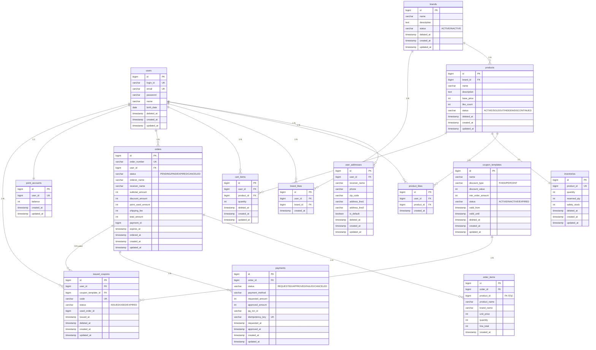

# 04. 전체 테이블 구조 및 관계 정리 (ERD)

---

## 설계 원칙

- **OrderSheet 제거**: Order 단일 테이블로 통합 (PENDING/PAID/EXPIRED/CANCELED)
- **소프트 삭제**: 모든 테이블에 `deleted_at` 컬럼 (좋아요 제외 - hard delete)
- **상태 관리**: `status` VARCHAR 컬럼으로 명확한 상태 전이 표현
- **가격**: `base_price` 단일 필드. 할인은 쿠폰 시스템으로 처리 (주문 단위 할인)
- **재고**: `inventories` 테이블 분리 (독립 도메인). 재고 예약은 Order(PENDING) + `reserved_qty`로 관리
- **재고 예약 만료**: 30분 (Order.expires_at 기준, 배치 처리)
- **FK 제약 미사용**: 논리 참조만 (DBML Ref)
- DBML 원본: `04-erd.dbml` 참조

---

## 1. 전체 ERD



---

## 2. 테이블 상세 명세

### 2-1. users (회원) - v1 완성

| 컬럼 | 타입 | 제약 | 설명 |
|------|------|------|------|
| id | BIGINT | PK, AUTO_INCREMENT | 사용자 PK |
| login_id | VARCHAR(80) | UNIQUE, NOT NULL | 로그인 아이디 |
| email | VARCHAR(255) | UNIQUE, NOT NULL | 이메일 |
| password | VARCHAR(255) | NOT NULL | 비밀번호 해시 |
| name | VARCHAR(100) | NOT NULL | 표시명 |
| birth_date | DATE | | 생년월일 |
| deleted_at | TIMESTAMP | NULL | soft delete |
| created_at | TIMESTAMP | NOT NULL | 생성 시각 |
| updated_at | TIMESTAMP | NOT NULL | 수정 시각 |

---

### 2-2. user_addresses (주소)

| 컬럼 | 타입 | 제약 | 설명 |
|------|------|------|------|
| id | BIGINT | PK, AUTO_INCREMENT | 주소 PK |
| user_id | BIGINT | NOT NULL | 사용자 ID |
| receiver_name | VARCHAR(100) | | 수령인 이름 |
| phone | VARCHAR(50) | | 연락처 |
| zip_code | VARCHAR(20) | | 우편번호 |
| address_line1 | VARCHAR(255) | | 주소1 |
| address_line2 | VARCHAR(255) | | 상세주소 |
| is_default | BOOLEAN | | 기본주소 여부 |
| deleted_at | TIMESTAMP | NULL | soft delete |
| created_at | TIMESTAMP | NOT NULL | 생성 시각 |
| updated_at | TIMESTAMP | NOT NULL | 수정 시각 |

**인덱스**: `idx_user_addresses_user_id(user_id)`, `idx_user_addresses_deleted_at(deleted_at)`

---

### 2-3. brands (브랜드)

| 컬럼 | 타입 | 제약 | 설명 |
|------|------|------|------|
| id | BIGINT | PK, AUTO_INCREMENT | 브랜드 PK |
| name | VARCHAR(150) | NOT NULL | 브랜드명 |
| description | TEXT | | 브랜드 설명 |
| status | VARCHAR(20) | NOT NULL, DEFAULT 'ACTIVE' | BRAND_STATUS |
| deleted_at | TIMESTAMP | NULL | soft delete |
| created_at | TIMESTAMP | NOT NULL | 생성 시각 |
| updated_at | TIMESTAMP | NOT NULL | 수정 시각 |

**인덱스**: `idx_brands_status(status)`, `idx_brands_deleted_at(deleted_at)`

---

### 2-4. products (상품)

| 컬럼 | 타입 | 제약 | 설명 |
|------|------|------|------|
| id | BIGINT | PK, AUTO_INCREMENT | 상품 PK |
| brand_id | BIGINT | NOT NULL | 소속 브랜드 |
| name | VARCHAR(200) | NOT NULL | 상품명 |
| description | TEXT | | 상세 설명 |
| base_price | INT | NOT NULL | 기본 가격 (할인은 쿠폰으로 처리) |
| like_count | INT | NOT NULL, DEFAULT 0 | 좋아요 수 (정렬용 비정규화) |
| status | VARCHAR(20) | NOT NULL, DEFAULT 'ACTIVE' | PRODUCT_STATUS |
| deleted_at | TIMESTAMP | NULL | soft delete |
| created_at | TIMESTAMP | NOT NULL | 생성 시각 |
| updated_at | TIMESTAMP | NOT NULL | 수정 시각 |

**인덱스**: `idx_products_brand_id(brand_id)`, `idx_products_status(status)`, `idx_products_deleted_at(deleted_at)`, `idx_products_created_at(created_at)`, `idx_products_base_price(base_price)`, `idx_products_like_count(like_count)`

**설계 결정**:
- `base_price` 단일 필드: 상시 할인가 없음. 할인은 쿠폰 시스템으로만 처리
- `like_count` 비정규화: 좋아요순 정렬 성능. 등록/취소 시 동기 증감
- 재고는 `inventories` 테이블에서 분리 관리

---

### 2-5. product_likes (상품 좋아요) - hard delete

| 컬럼 | 타입 | 제약 | 설명 |
|------|------|------|------|
| id | BIGINT | PK, AUTO_INCREMENT | 좋아요 PK |
| user_id | BIGINT | NOT NULL | 사용자 |
| product_id | BIGINT | NOT NULL | 대상 상품 |
| created_at | TIMESTAMP | NOT NULL | 좋아요 시각 |

**유니크 제약**: `uk_product_likes(user_id, product_id)`

**인덱스**: `idx_product_likes_user_id(user_id)`, `idx_product_likes_product_id(product_id)`

**hard delete 정책**: 이력 추적 불필요. 좋아요 취소 시 row 삭제. UK 충돌 문제 없음.

---

### 2-6. brand_likes (브랜드 좋아요) - hard delete

| 컬럼 | 타입 | 제약 | 설명 |
|------|------|------|------|
| id | BIGINT | PK, AUTO_INCREMENT | 좋아요 PK |
| user_id | BIGINT | NOT NULL | 사용자 |
| brand_id | BIGINT | NOT NULL | 대상 브랜드 |
| created_at | TIMESTAMP | NOT NULL | 좋아요 시각 |

**유니크 제약**: `uk_brand_likes(user_id, brand_id)`

---

### 2-7. cart_items (장바구니 항목)

| 컬럼 | 타입 | 제약 | 설명 |
|------|------|------|------|
| id | BIGINT | PK, AUTO_INCREMENT | 항목 PK |
| user_id | BIGINT | NOT NULL | 사용자 ID |
| product_id | BIGINT | NOT NULL | 상품 ID |
| quantity | INT | NOT NULL | 수량 |
| deleted_at | TIMESTAMP | NULL | soft delete |
| created_at | TIMESTAMP | NOT NULL | 생성 시각 |
| updated_at | TIMESTAMP | NOT NULL | 수정 시각 |

**유니크 제약**: `uk_cart_items(user_id, product_id)` - 동일 상품 추가 시 수량 merge

**설계 결정**: carts 테이블 제거. 발제에 장바구니 전체 비즈니스 규칙이 없으므로 cart_items가 user_id를 직접 참조.

---

### 2-8. inventories (재고)

| 컬럼 | 타입 | 제약 | 설명 |
|------|------|------|------|
| id | BIGINT | PK, AUTO_INCREMENT | 재고 PK |
| product_id | BIGINT | UNIQUE, NOT NULL | 상품 ID (1:1) |
| quantity | INT | NOT NULL, DEFAULT 0 | 총 재고 수량 |
| reserved_qty | INT | NOT NULL, DEFAULT 0 | 예약 수량 |
| safety_stock | INT | NOT NULL, DEFAULT 0 | 안전재고 기준 |
| deleted_at | TIMESTAMP | NULL | soft delete |
| created_at | TIMESTAMP | NOT NULL | 생성 시각 |
| updated_at | TIMESTAMP | NOT NULL | 수정 시각 |

**가용 재고 계산**: `available = quantity - reserved_qty`

**재고 예약 흐름** (Order 기반):
1. 주문 생성(PENDING) → `reserved_qty += 수량` (비관적 락)
2. 결제 성공(PAID) → `quantity -= 수량`, `reserved_qty -= 수량`
3. 결제 실패/만료 → `reserved_qty -= 수량` (order_items 기준으로 복구)

**설계 결정**: 별도 reservation 테이블 없이 Order(PENDING) + order_items가 예약 정보 역할을 겸함. 만료 배치는 `orders.status = PENDING AND expires_at < now()` 기준으로 동작.

---

### 2-9. orders (주문 - OrderSheet 통합)

| 컬럼 | 타입 | 제약 | 설명 |
|------|------|------|------|
| id | BIGINT | PK, AUTO_INCREMENT | 주문 PK |
| order_number | VARCHAR(50) | UNIQUE, NOT NULL | 주문번호(외부노출) |
| user_id | BIGINT | NOT NULL | 사용자 ID |
| status | VARCHAR(20) | NOT NULL | PENDING/PAID/EXPIRED/CANCELED |
| orderer_name | VARCHAR(100) | NOT NULL | 주문자 이름 |
| orderer_phone | VARCHAR(50) | NOT NULL | 주문자 연락처 |
| receiver_name | VARCHAR(100) | NOT NULL | 수령인 이름 |
| receiver_phone | VARCHAR(50) | NOT NULL | 수령인 연락처 |
| zip_code | VARCHAR(20) | NOT NULL | 우편번호 |
| address_line1 | VARCHAR(255) | NOT NULL | 주소1 |
| address_line2 | VARCHAR(255) | | 상세주소 |
| subtotal_amount | INT | NOT NULL | 상품 합계 |
| discount_amount | INT | NOT NULL, DEFAULT 0 | 쿠폰 할인 합계 (주문 단위) |
| point_used_amount | INT | NOT NULL, DEFAULT 0 | 포인트 사용액 |
| shipping_fee | INT | NOT NULL, DEFAULT 0 | 배송비 |
| total_amount | INT | NOT NULL | 최종 결제 금액 |
| payment_method | VARCHAR(30) | | 결제수단 |
| payment_id | BIGINT | | 승인된 결제 ID |
| ordered_at | TIMESTAMP | | 결제 완료 시각 |
| expires_at | TIMESTAMP | NOT NULL | 결제 만료 시각 (생성 + 30분) |
| canceled_at | TIMESTAMP | | 취소 시각 |
| created_at | TIMESTAMP | NOT NULL | 생성 시각 |
| updated_at | TIMESTAMP | NOT NULL | 수정 시각 |

**인덱스**: `uk_orders_order_number`, `idx_orders_user_id_status`, `idx_orders_status_expires_at`, `idx_orders_user_id_created_at`

**OrderSheet 통합 설계**:
- `PENDING` 상태가 기존 OrderSheet의 역할을 대체
- `PENDING`에서만 쿠폰/포인트 적용, 배송지 수정 가능
- `PAID` 전환 시 스냅샷 확정 (수정 불가)
- `total_amount = subtotal_amount - discount_amount - point_used_amount + shipping_fee`

---

### 2-10. order_items (주문항목 - 스냅샷)

| 컬럼 | 타입 | 제약 | 설명 |
|------|------|------|------|
| id | BIGINT | PK, AUTO_INCREMENT | 항목 PK |
| order_id | BIGINT | NOT NULL | 주문 ID |
| product_id | BIGINT | NOT NULL | 상품 ID (FK 아님) |
| product_name | VARCHAR(200) | NOT NULL | 상품명 스냅샷 |
| brand_name | VARCHAR(150) | NOT NULL | 브랜드명 스냅샷 |
| unit_price | INT | NOT NULL | 단가 스냅샷 (base_price) |
| quantity | INT | NOT NULL | 수량 |
| line_total | INT | NOT NULL | 라인 금액 (unit_price * quantity) |
| created_at | TIMESTAMP | NOT NULL | 생성 시각 |

**설계 의도**: 주문 시점의 상품 정보를 고정 저장. 원본 상품이 변경/삭제되어도 유지.

**설계 결정**: `discounted_unit_price` 제거. 쿠폰 할인은 주문 단위(`orders.discount_amount`)로 관리하므로 상품별 할인 단가 불필요.

---

### 2-11. payments (결제)

| 컬럼 | 타입 | 제약 | 설명 |
|------|------|------|------|
| id | BIGINT | PK, AUTO_INCREMENT | 결제 PK |
| order_id | BIGINT | NOT NULL | 주문 ID |
| status | VARCHAR(20) | NOT NULL | REQUESTED/APPROVED/FAILED/CANCELED |
| payment_method | VARCHAR(30) | NOT NULL | 결제수단 |
| requested_amount | INT | NOT NULL | 요청 금액 |
| approved_amount | INT | | 승인 금액 |
| pg_txn_id | VARCHAR(100) | | PG 거래 식별자 |
| idempotency_key | VARCHAR(80) | UNIQUE | 멱등키 |
| requested_at | TIMESTAMP | NOT NULL | 요청 시각 |
| approved_at | TIMESTAMP | | 승인 시각 |
| failed_at | TIMESTAMP | | 실패 시각 |
| created_at | TIMESTAMP | NOT NULL | 생성 시각 |
| updated_at | TIMESTAMP | NOT NULL | 수정 시각 |

**설계 결정**: 하나의 주문에 여러 결제 시도 가능 (실패 → 재시도). `orders.payment_id`는 최종 승인된 결제만 가리킴.

---

### 2-12. point_accounts (포인트 계좌)

| 컬럼 | 타입 | 제약 | 설명 |
|------|------|------|------|
| id | BIGINT | PK, AUTO_INCREMENT | 계좌 PK |
| user_id | BIGINT | UNIQUE, NOT NULL | 사용자 ID (1:1) |
| balance | INT | NOT NULL, DEFAULT 0 | 현재 잔액 |
| created_at | TIMESTAMP | NOT NULL | 생성 시각 |
| updated_at | TIMESTAMP | NOT NULL | 수정 시각 |

**설계 결정**: Point를 독립 도메인으로 유지. User와 책임 분리. point_ledgers(이력 테이블)는 발제 요구사항에 없으므로 제거.

---

### 2-13. coupon_templates (쿠폰 템플릿)

| 컬럼 | 타입 | 제약 | 설명 |
|------|------|------|------|
| id | BIGINT | PK, AUTO_INCREMENT | 템플릿 PK |
| name | VARCHAR(200) | NOT NULL | 쿠폰명 |
| description | TEXT | | 쿠폰 설명 |
| discount_type | VARCHAR(20) | NOT NULL | FIXED/PERCENT |
| discount_value | INT | NOT NULL | 할인 값 |
| max_discount_amount | INT | | 최대 할인액 (정률용) |
| min_order_amount | INT | NOT NULL | 최소 주문금액 |
| valid_from | TIMESTAMP | NOT NULL | 유효 시작일 |
| valid_until | TIMESTAMP | NOT NULL | 유효 종료일 |
| issue_limit | INT | | 전체 발급 제한 |
| per_user_limit | INT | | 유저별 발급 제한 |
| status | VARCHAR(20) | NOT NULL | ACTIVE/INACTIVE/EXPIRED |
| deleted_at | TIMESTAMP | NULL | soft delete |
| created_at | TIMESTAMP | NOT NULL | 생성 시각 |
| updated_at | TIMESTAMP | NOT NULL | 수정 시각 |

**설계 결정**: coupon_targets 테이블 제거. 쿠폰은 주문 전체에 적용. 상품별/브랜드별 타겟팅은 발제 요구사항 아님.

---

### 2-14. issued_coupons (발급 쿠폰)

| 컬럼 | 타입 | 제약 | 설명 |
|------|------|------|------|
| id | BIGINT | PK, AUTO_INCREMENT | 발급 쿠폰 PK |
| user_id | BIGINT | NOT NULL | 사용자 ID |
| coupon_template_id | BIGINT | NOT NULL | 쿠폰 템플릿 ID |
| code | VARCHAR(100) | UNIQUE, NOT NULL | 쿠폰 코드 |
| status | VARCHAR(20) | NOT NULL | ISSUED/USED/EXPIRED |
| issued_at | TIMESTAMP | NOT NULL | 발급 시각 |
| used_order_id | BIGINT | | 사용 주문 ID (USED 시 설정) |
| deleted_at | TIMESTAMP | NULL | soft delete |
| created_at | TIMESTAMP | NOT NULL | 생성 시각 |
| updated_at | TIMESTAMP | NOT NULL | 수정 시각 |

**설계 결정**: 상태를 5단계(ISSUED/RESERVED/REDEEMED/EXPIRED/CANCELED)에서 3단계(ISSUED/USED/EXPIRED)로 단순화. 결제 성공 시 바로 USED 처리.

---

## 3. 제약 조건 및 정합성 정책

| 테이블 | 제약 | 유형 | 설명 |
|--------|------|------|------|
| products | brand_id → brands.id | 논리 FK | 상품은 반드시 브랜드에 소속 |
| product_likes | (user_id, product_id) | UK | 중복 좋아요 방지 |
| brand_likes | (user_id, brand_id) | UK | 중복 좋아요 방지 |
| cart_items | (user_id, product_id) | UK | 동일 상품 중복 방지 |
| inventories | product_id | UK | 상품당 재고 1건 (1:1) |
| inventories | quantity >= 0, reserved_qty >= 0 | 앱 검증 | 음수 방지 |
| orders | order_number | UK | 주문번호 유일성 |
| order_items | product_id | 참조만 | FK 아님 - 스냅샷 유지 |
| payments | idempotency_key | UK | PG 중복 요청 방지 |
| issued_coupons | code | UK | 쿠폰 코드 유일성 |

---

## 4. 소프트 삭제 정책

| 테이블 | soft delete | 정책 |
|--------|-----------|------|
| users | deleted_at | v1 완성 |
| user_addresses | deleted_at | 주소 삭제 |
| brands | deleted_at | 삭제 시 소속 products + inventories 연쇄 soft delete |
| products | deleted_at | 삭제되어도 기존 order_items 스냅샷 유지 |
| **product_likes** | **hard delete** | 취소 시 row 삭제. 이력 불필요 |
| **brand_likes** | **hard delete** | 취소 시 row 삭제. 이력 불필요 |
| cart_items | deleted_at | 장바구니 상품 제거 |
| inventories | deleted_at | 상품 삭제 시 함께 soft delete |
| orders | 상태 관리 | 취소는 status=CANCELED. deleted_at 미사용 |
| order_items | 없음 | 스냅샷 - 변경/삭제 불가 |
| payments | 상태 관리 | 상태 전이로 관리 |
| point_accounts | 없음 | 계좌 삭제 없음 |
| coupon_templates | deleted_at | |
| issued_coupons | deleted_at + 상태 | 상태 전이 + soft delete 병행 |

---

## 5. 인덱스 전략

| 테이블 | 인덱스 | 용도 |
|--------|--------|------|
| products | `idx_products_brand_id` | 브랜드별 상품 필터링 |
| products | `idx_products_status` | 상태별 조회 |
| products | `idx_products_created_at` | 최신순 정렬 |
| products | `idx_products_base_price` | 가격순 정렬 |
| products | `idx_products_like_count` | 좋아요순 정렬 |
| product_likes | `uk_product_likes(user_id, product_id)` | 중복 방지 + 존재 여부 |
| brand_likes | `uk_brand_likes(user_id, brand_id)` | 중복 방지 + 존재 여부 |
| cart_items | `uk_cart_items(user_id, product_id)` | 동일 상품 중복 방지 |
| inventories | `uk_inventories_product_id` | 상품당 재고 1건 |
| orders | `uk_orders_order_number` | 주문번호 조회 |
| orders | `idx_orders_user_id_created_at` | 사용자별 주문 목록 |
| orders | `idx_orders_status_expires_at` | 배치 만료 처리 |
| order_items | `idx_order_items_order_id` | 주문별 항목 조회 |
| payments | `uk_payments_idempotency_key` | 멱등성 보장 |
| issued_coupons | `uk_issued_coupons_code` | 쿠폰 코드 조회 |
| issued_coupons | `idx_issued_coupons_user_id_status` | 사용자별 쿠폰 목록 |

---

## 6. 상태 전이 다이어그램

### Order 상태

```
PENDING ──결제성공──→ PAID
   │
   ├──30분경과──→ EXPIRED   (배치)
   │
   └──결제실패/취소──→ CANCELED
```

### IssuedCoupon 상태

```
ISSUED ──결제성공──→ USED
  │
  └──유효기간만료──→ EXPIRED
```

### Payment 상태

```
REQUESTED ──PG승인──→ APPROVED
     │
     └──PG거절──→ FAILED
                    │
          APPROVED ──취소──→ CANCELED
```

---

## 7. 단순화 변경 이력

| 변경 | 내용 | 근거 |
|------|------|------|
| C1 | `coupon_targets` 테이블 제거 | 상품별/브랜드별 쿠폰 대상 지정 요구사항 없음 |
| C2 | IssuedCoupon 상태 5→3단계 (ISSUED/USED/EXPIRED) | RESERVED 상태의 보상 로직 복잡도 제거 |
| C3 | `inventory_reservations` + `items` 2테이블 제거, `orders.reservation_id` 제거 | Order(PENDING) + order_items가 동일 정보 보유 |
| C4 | `point_ledgers` 테이블 제거 | 발제에 포인트 변동 이력 추적 요구사항 없음 |
| C5 | `carts` 테이블 제거, cart_items가 user_id 직접 참조 | 장바구니 전체 비즈니스 규칙 없음 |
| C6 | `order_items.discounted_unit_price` 컬럼 제거 | 쿠폰 할인은 주문 단위 관리 |